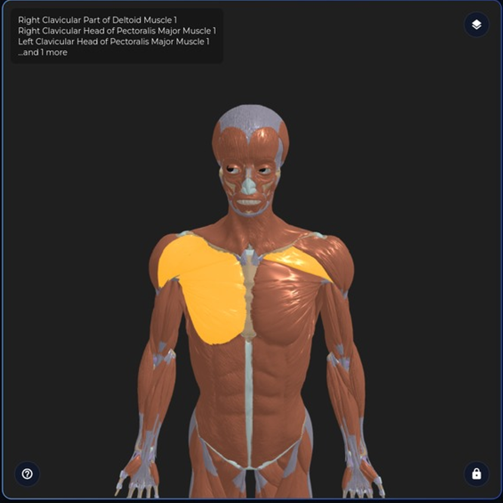
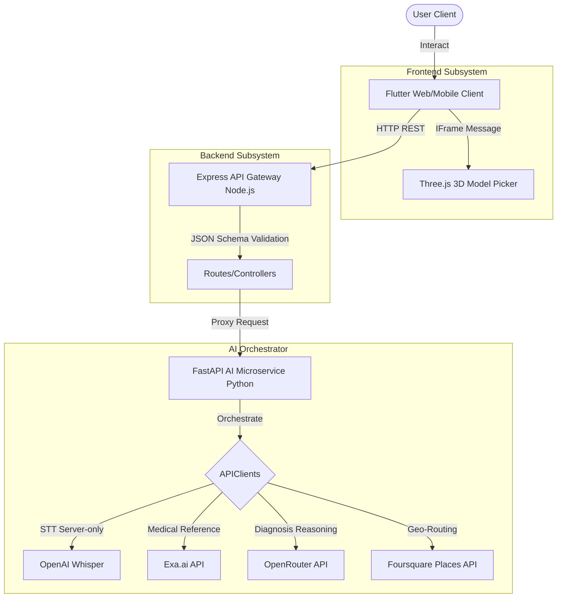
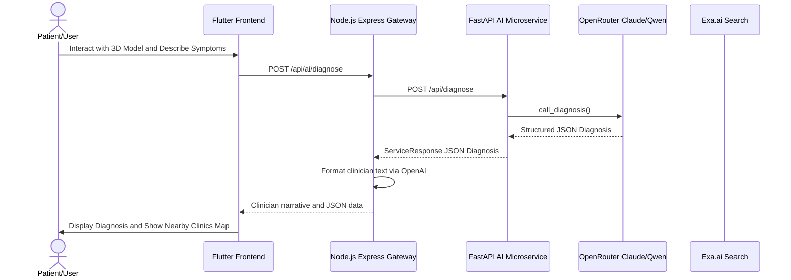

# BodyCheck — AI-Powered Medical Triage & 3D Symptom Checker

BodyCheck is a lightweight medical guidance service designed to help users quickly describe, localize, and triage pain through an interactive 3D body model. After a user identifies affected body regions and provides symptom details, the system uses a coordinated network of AI services to generate clinician-style preliminary guidance. This includes possible conditions, recommended next steps, treatment considerations, and real-time nearby healthcare facility routing.

The **1st MVP** of this project was successfully completed during the **LotusHacks 2026 Hackathon**—the largest hackathon in Vietnam.

<p align="center">
  
</p>

---

## 🎬 Demo Video

<p align="center">
  <a href="https://www.youtube.com/watch?v=n5hkWZSG4bc" target="_blank">
    
  </a>
  <br/>
  <em>▶ Click to watch the full demo on YouTube</em>
</p>

---

## Key Features

* **Interactive 3D Anatomical Body Map:** Uses a real 3D anatomical model (rendered via Three.js inside a Flutter Web iframe wrapper) that lets users orbit, zoom, and click specific muscle groups/organs to pinpoint pain regions.
* **Dual-Language Route Optimization:** Natively supports both English and Vietnamese:
  * **English requests:** Routed to **Claude 3.5 Sonnet** (via OpenRouter) for clinical reasoning.
  * **Vietnamese requests:** Routed to **Qwen-2.5-72B-Instruct** for native, culturally fluent medical translation and localization.
* **Multi-Modal AI Stack Integration:** Co-ordinates various AI and Web APIs:
  * **OpenRouter / OpenAI:** Outpatient clinician roleplay and diagnostics.
  * **Exa.ai:** Real-time authoritative medical citation retrieval (Mayo Clinic, WebMD, Healthline, Vinmec).
  * **OpenAI Whisper:** Speech-to-Text symptom recording endpoint (available on server, unused by client).
  * **Foursquare / Places API:** Spatial clinic recommendations based on user coordinates.
* **Decoupled Two-Tier Architecture:** Splits frontend public traffic from upstream AI models. The Node/Express backend serves as a secure API gateway, while the Python FastAPI service coordinates AI providers.

---

## Architecture & Data Flow

### System Subsystems Diagram



### Sequence Triage Diagram



---

## Repository Structure

The project is structured into three main components:

* **[`/frontend`](./frontend/) (Flutter Mobile/Web):** Renders the user-facing app, including the interactive Three.js 3D canvas loader and symptom forms.
* **[`/backend`](./backend/) (Node.js/Express):** Serves as the public API Gateway, handling request routing, validation, error middleware, and authentication.
* **[`/ai_dev`](./ai_dev/) (Python/FastAPI):** Orchestrates AI endpoints, coordinates API keys, maintains session history, and parses structured clinical responses.
* **[`/documentation`](./documentation/) (Project History):** Contains system proposals, track guidelines, developer handoffs, and hackathon slides.

---

## Getting Started

### 1. Configure the Environment
Copy the public-safe template to create your `.env` file in the **project root**:
```bash
cp .env.example .env
```
Fill in the API keys in `.env`:
* `OPENROUTER_KEY`: Credentials from OpenRouter (Claude/Qwen access).
* `EXA_KEY`: Search key from Exa.ai.
* `OPENAI_API_KEY`: Key from OpenAI (Whisper & Clinician Chat).
* `FOURSQUARE_API_KEY`: API key from Foursquare/Google Places.
* `ELEVENLABS_KEY`: (Optional) Speech synthesis key (unused by client).


---

### 2. Run the AI Microservice (`ai_dev`)
1. Create and activate a Python virtual environment:
   ```bash
   python -m venv .venv
   # Windows:
   .venv\Scripts\activate
   # macOS/Linux:
   source .venv/bin/activate
   ```
2. Install dependencies:
   ```bash
   pip install -r ai_dev/requirements.txt
   ```
3. Run the FastAPI development server:
   ```bash
   python -m uvicorn ai_dev.src.server:app --host 127.0.0.1 --port 8016 --reload
   ```
   * *Swagger documentation is available at `http://127.0.0.1:8016/docs`.*
   * *Interactive developer console is available at `http://127.0.0.1:8016/demo`.*

---

### 3. Run the Backend API Gateway (`backend`)
1. Navigate to the backend directory and install Node modules:
   ```bash
   cd backend
   npm install
   ```
2. Start the Express server:
   ```bash
   npm run dev
   ```
   * *The gateway server will run on `http://localhost:3000`.*
   * *Ensure the local `.env` variables from the root are copied/made accessible inside the `backend/` directory.*

---

### 4. Run the Flutter Frontend (`frontend`)
1. Navigate to the Flutter project:
   ```bash
   cd frontend/hackathon_clavicular
   ```
2. Fetch Flutter packages:
   ```bash
   flutter pub get
   ```
3. Launch the development server:
   ```bash
   flutter run -d chrome
   ```

---

## The Team (Hackathon Clavicular)

We are a group of Computer Science students from the **APCS (Advanced Program in Computer Science)** and **CLC (High Quality Program)** divisions of the **IT Faculty at Ho Chi Minh City University of Science (HCMUS)**:

* **Nguyen Dinh Thien Loc (AI Dev / Brain):** Handled OpenAI clinician integration, prompt engineering, OpenRouter routing optimization, speech synthesis (ElevenLabs), and server microservices.
* **Quach Thien Lac (Frontend / UI):** Created the Flutter mobile interface, integrated the Three.js 3D canvas iframe wrappers, and wired forms to the gateway.
* **Nguyen Quoc Nam (3D Model Design):** Created, optimized, and mapped the interactive 3D assets (`my_model.glb`, `organ.glb`, `skele.glb`).
* **Tran Ton Minh Ky (Backend / Gateway):** Engineered the Node.js/Express API Gateway routes, request validator middleware, and error-handling controllers.

---

## Medical Disclaimer

> **BodyCheck is an AI tool for general informational support only and is not a substitute for professional medical advice, diagnosis, or treatment. If you are experiencing a medical emergency, please call 115 (or your local emergency services) immediately.**

---

## License

This project is licensed under the MIT License - see the [LICENSE](./LICENSE) file for details.

